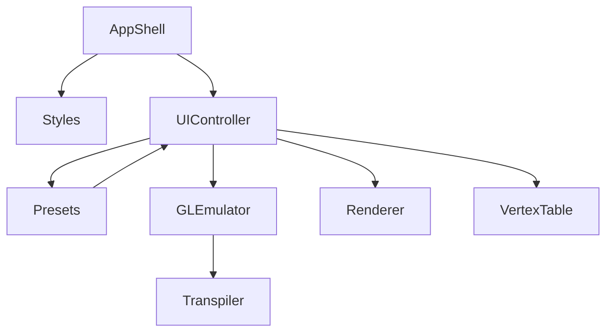

# CG_Drawing — Architecture

## 1. Stack
- Plain HTML5 / CSS3 / vanilla JavaScript (ES6, single IIFE) — no framework.
- No build step, no npm, no package manager (no manifest file present at repo root).
- Rendering via `<canvas>` 2D context (Canvas-2D emulation of OpenGL immediate mode).
- Static hosting: GitHub Pages, deployed via `.github/workflows/deploy.yml` (per README).

## 2. Directory map
| path | what lives there |
|---|---|
| `index.html` | app shell — header/tabs, Graph canvas, GLUT canvas, code editor, vertex table markup |
| `app.js` | entire app logic: C++→JS transpiler, GL/GLUT emulator, renderers, vertex table, presets, UI wiring |
| `styles.css` | all visual styling |
| `README.md` | project docs, supported GL subset, run/deploy instructions |
| `.github/workflows/` | `deploy.yml` — GitHub Pages deploy on push to `main` (per README; not opened) |

## 3. Diagram

## 4. Component index
- [[AppShell]]
- [[Styles]]
- [[UIController]]
- [[Presets]]
- [[GLEmulator]]
- [[Transpiler]]
- [[Renderer]]
- [[VertexTable]]

## 5. Entry points
- **Dev:** open `index.html` directly in a browser, or `python3 -m http.server 8000` from repo root then visit `http://localhost:8000` (README "Run locally").
- **Prod:** GitHub Pages, auto-published on push to `main` via `.github/workflows/deploy.yml` (README "Deployment (GitHub Pages)").

## 6. Conventions
- All of `app.js` is one IIFE: `(function () { 'use strict'; ... })();`.
- DOM lookup helper `const $ = (id) => document.getElementById(id);` used throughout.
- File is organized into numbered `/* === N. NAME === */` comment sections (1. GL EMULATOR … 13. WIRING) — module boundaries are comment sections, not files.
- No bundler: `index.html` loads `app.js` via a single `<script src="app.js">` tag at the end of `<body>`.
- Styling lives entirely in `styles.css`, linked via `<link rel="stylesheet">` in `<head>`.
- GL color state stored internally as one canonical form: 0–255 integers (`glColor3f` scales ×255, `glColor3ub` passes through).

## 7. Where things go
- **Support a new GL/GLUT call:** add it to `GL_FUNCS` (and `GL_CONSTS` if it introduces a constant) in `app.js` §1.
- **Change how C++ source is rewritten to JS:** edit `transpile()` in `app.js` §2.
- **Add a new preset program:** add an entry to `buildPresets()` in `app.js`'s PRESET PROGRAMS section (use the `wrap()` helper for the boilerplate `main`/`display`).
- **Change canvas drawing/visual output:** edit `renderGraph()` / `renderGlut()` in `app.js` §6; update `styles.css` for chrome/UI look.
- **Change page layout or add a tab:** edit `index.html` markup and the matching wiring in `app.js` §13.
